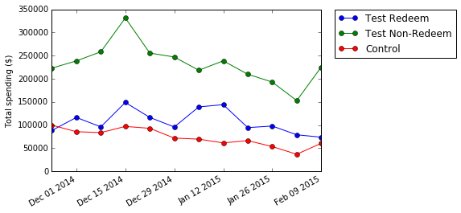
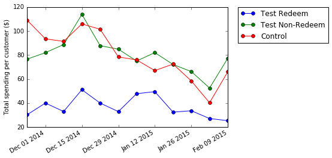

## Analytics Case Solution

### Bahman Roostaei

### 1. Append a new column to the data in 'All Users' that identifies which buyers in the Test group were Redeemers and which were Non-Redeemers.														

<table border="1" class="dataframe">
  <thead>
    <tr style="text-align: right;">
      <th></th>
      <th>User ID</th>
      <th>Redeemer</th>
    </tr>
  </thead>
  <tbody>
    <tr>
      <th>0</th>
      <td>122349</td>
      <td>1</td>
    </tr>
    <tr>
      <th>1</th>
      <td>799706</td>
      <td>1</td>
    </tr>
    <tr>
      <th>2</th>
      <td>1032626</td>
      <td>1</td>
    </tr>
    <tr>
      <th>3</th>
      <td>3535542</td>
      <td>1</td>
    </tr>
    <tr>
      <th>4</th>
      <td>4369508</td>
      <td>1</td>
    </tr>
  </tbody>
</table>

#### df index is now the User ID:

<table border="1" class="dataframe">
  <thead>
    <tr style="text-align: right;">
      <th></th>
      <th>Group</th>
      <th>Week</th>
      <th>Spend</th>
      <th>Purchases</th>
      <th>Redeemer</th>
    </tr>
    <tr>
      <th>User ID</th>
      <th></th>
      <th></th>
      <th></th>
      <th></th>
      <th></th>
    </tr>
  </thead>
  <tbody>
    <tr>
      <th>228373538</th>
      <td>Test</td>
      <td>11/17/14</td>
      <td>$\t63.16</td>
      <td>1</td>
      <td>0</td>
    </tr>
    <tr>
      <th>18359220</th>
      <td>Test</td>
      <td>2/9/15</td>
      <td>$\t13.12</td>
      <td>1</td>
      <td>0</td>
    </tr>
    <tr>
      <th>128597303</th>
      <td>Test</td>
      <td>10/27/14</td>
      <td>$\t328.88</td>
      <td>5</td>
      <td>1</td>
    </tr>
    <tr>
      <th>185191994</th>
      <td>Test</td>
      <td>10/27/14</td>
      <td>$\t78.61</td>
      <td>7</td>
      <td>0</td>
    </tr>
    <tr>
      <th>9155956</th>
      <td>Control</td>
      <td>10/6/14</td>
      <td>$\t54.54</td>
      <td>1</td>
      <td>0</td>
    </tr>
    <tr>
      <th>612341541</th>
      <td>Test</td>
      <td>10/27/14</td>
      <td>$\t67.38</td>
      <td>1</td>
      <td>0</td>
    </tr>
    <tr>
      <th>168296194</th>
      <td>Test</td>
      <td>11/10/14</td>
      <td>$\t23.25</td>
      <td>1</td>
      <td>0</td>
    </tr>
    <tr>
      <th>75292137</th>
      <td>Test</td>
      <td>10/20/14</td>
      <td>$\t327.16</td>
      <td>5</td>
      <td>0</td>
    </tr>
    <tr>
      <th>41881793</th>
      <td>Test</td>
      <td>10/13/14</td>
      <td>$\t81.52</td>
      <td>2</td>
      <td>1</td>
    </tr>
    <tr>
      <th>686490932</th>
      <td>Control</td>
      <td>11/24/14</td>
      <td>$\t77.12</td>
      <td>5</td>
      <td>0</td>
    </tr>
  </tbody>
</table>

### 2. For each group (Control, Test-Redeemers, Test-NonRedeemers), show how spend varied over the 12 week period between 24th November 14 and 9th February 15 (from 6 weeks before the coupon 'drop date' to 6 weeks after). Graphical results are always welcome!	
															

#### Plot of non-normalized data:

#### Plot of normalized data:

### 3. What is the incremental spend in the six weeks after the coupons were sent (additional spend above what we would have expected had no coupon been sent out) for the total Test group (Redeemers and Non-Redeemers) vs. Control? Please express your answer in absolute ($) and % terms. You can use Excel or any other tool of your choice (e.g. R).	

#### We take the spend by test group in six week after coupons are sent (Jan 5th 2015) and subtract the spend before the coupons were sent:

    Incremental spend in six weeks after coupons were sent out for test group:
     $ -3384779.240000056
    In fact we see a reduction in total spend.

#### Then We take the spend by control group in six week after coupons are sent (Jan 5th 2015) and subtract the spend before the coupons were sent:

    Incremental spend in six weeks after coupons were sent out for control group:
     $ -936454.5699999986
    In fact we see a reduction in total spend.

#### Now we take the relative difference of the above two numbers:

    Comparing the test and control incremental spend:
    2.614461767216387

#### The test group shows 2.6 times higher in reduction in spend.
#### However it makes more sense to measure the above values per customer so we perform the same calculation as above and normalize it (divide by the number of customers):

    total increment per test customer:
    $ -807.7031479393006
    percentage: -55.796212128011156 

    total increment per control customer:
    $ -931.9504326689521
    percentage: -64.84797583885303 %

#### We see that the control customer shows more reduction in spend after coupons were sent out (64.8% vs. 55.8%).

### 4. We calculate revenue as Revenue = Spend x Take Rate. Assuming that Take Rate is 10% and that the cost of the coupon campaign is equal to the value of a coupon multiplied by the number of coupons redeemed, calculate the ROI of this campaign. 

#### We take the total spend by test group after the coupons were sent and subtract the total spend by control group on that time period:

    total spend difference from control group:
    $ 85259.11300000019

#### However it makes more sense to draw conclusions per customer (adjust to the number of customers involved in each group). So we take the total spend by test group and divide by the number of test customers, then we subtract the same ratio for control group. We also subtract $10 for coupon cost for each customer and divide the whole number by $10 coupon cost invested per customer (We also include tha take rate):

    Adjusted ROI:
    37.57709481839164 %

